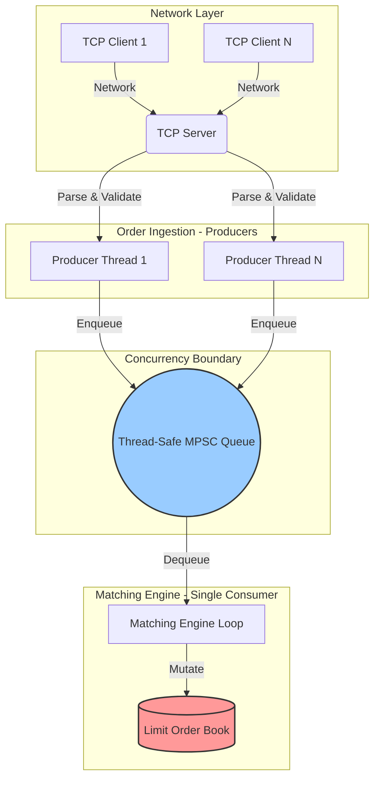

# ⚡ High-Performance Multithreaded Order Book & Matching Engine


A portfolio-grade, ultra-low-latency Limit Order Book (LOB) and Matching Engine written in modern C++20. This project is designed to simulate the core backend infrastructure of financial and cryptocurrency exchanges, demonstrating advanced systems engineering, thread synchronization, and data structure optimization.

## 🚀 Key Features

- **Blazing Fast Throughput:** Capable of processing over **1.4 Million orders per second** on standard consumer hardware.
- **Sub-Microsecond Latency:** Average order processing latency of **~250 nanoseconds**.
- **$O(1)$ Order Cancellations:** Utilizes a highly optimized `std::unordered_map` index intertwined with `std::list` iterators to achieve constant-time cancellations without scanning price levels.
- **Lock-Free Hot Path:** Implements a Multiple-Producer, Single-Consumer (MPSC) architecture. The matching engine exclusively owns the order book, entirely eliminating cache-line invalidation, false sharing, and the need for granular mutex locks during matching.
- **POSIX Networking:** Fully functional multithreaded TCP Server and Client to accept orders over the network.
- **Sanitizer Validated:** Build matrix rigorously tested against AddressSanitizer (ASAN), UndefinedBehaviorSanitizer (UBSAN), and ThreadSanitizer (TSAN) for memory and thread safety.

## 🧠 Architecture Overview

To achieve deterministic execution and minimal contention, the system strictly separates Order ingestion (Network/Producers) from Order matching (Consumer).



## 📊 Performance & Benchmarks

The project ships with a built-in benchmarking suite that stresses the engine using a randomized mix of standard distributions.

*Hardware tested: Windows host via Docker WSL2 (8 Cores allocated).*

| Metric | Result |
|--------|--------|
| **Throughput (Orders/sec)** | `1,412,429` |
| **Average Latency** | `249 ns` |
| **P50 Latency** | `141 ns` |
| **P95 Latency** | `481 ns` |
| **P99 Latency** | `1.26 µs` |

## 🛠️ Getting Started

### Prerequisites
- **Linux** (or Windows via **WSL2** / **Docker**)
- **CMake** 3.20+
- **GCC** 11+ / **Clang** 14+ (C++20 support required)

### Option 1: Docker (Easiest Method)
You can automatically build and run the entire suite using the provided `Dockerfile`.

```bash
# Build the Docker image
docker build -t orderbook-engine .

# Run the automated test suite
docker run --rm orderbook-engine ./build/unit_tests

# Run the extreme performance benchmark
docker run --rm orderbook-engine ./build/benchmark --orders 500000 --producers 4
```


### Option 2: Native CMake Build
```bash
# Clone the repository
git clone https://github.com/yourusername/high-performance-orderbook.git
cd high-performance-orderbook

# Configure and compile
cmake -S . -B build -DCMAKE_BUILD_TYPE=Release
cmake --build build -j$(nproc)
```

## 🎮 Interactive Demo (TCP Networking)

You can launch the engine as a live TCP server and connect to it as a client to submit live orders.

**Terminal 1 (Start the Server):**
```bash
./build/matching_engine --port 9000
```

**Terminal 2 (Start the Client):**
```bash
./build/order_client --host 127.0.0.1 --port 9000
```

**Submit Commands in the Client:**
```text
NEW BUY 1001 105 50    (Places Buy Order #1001 for 50 shares at $105)
NEW SELL 2001 105 50   (Places matching Sell Order, instantly executing trade!)
CANCEL 1001            (Cancels Order #1001 in O(1) time)
```


## 📁 Directory Structure
- `include/`: C++ header definitions (Domain Models, TCP Interfaces, Data Structures).
- `src/`: Core implementation logic.
- `benchmarks/`: Multi-threaded benchmarking and stress-testing executables.
- `tests/`: GTest-style deterministic unit logic tests.
- `tools/`: Network client CLI application.
- `docs/`: Extensive design writeups on concurrency and algorithmic choices.

## 🔮 Future Optimizations (TODO)
While currently highly performant, this engine can be evolved further:
1. **Custom Memory Arenas:** Replace STL default allocators (`new`/`delete` inside `std::list`) with a pre-allocated slab allocator/object pool to guarantee zero dynamic allocations on the hot path.
2. **Lock-Free Queue (Ring Buffer):** Replace the `std::mutex` bounded queue with an atomic LMAX Disruptor-style ring buffer.
3. **Kernel Bypass:** Replace POSIX Sockets with `epoll` or `io_uring`, or bypass the kernel entirely using DPDK for network ingestion.
4. **Thread Affinity:** Pin the Consumer thread to an isolated CPU core via `pthread_setaffinity_np` to eliminate OS context-switching.
